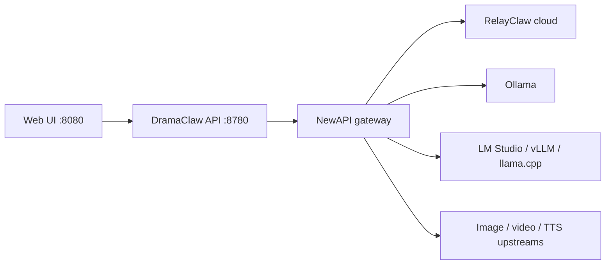

<!-- lang-switch -->
**English** · [简体中文](../../zh/guides/local-llms.md)

# Using DramaClaw with Local LLMs

> End-to-end guide for Ollama (and other OpenAI-compatible local servers) behind Local NewAPI.

DramaClaw does **not** load LLMs on the app host. The API (`:8780`) and web UI (`:8080`) call an **OpenAI-compatible NewAPI gateway**; that gateway talks to upstream providers (cloud or local). Gateway address and token are saved from **Settings → Model Configuration** into local `settings.db` — CE does not read them from `MODEL_API_KEY` / `MODEL_PROVIDER` environment variables.



For channel buttons, embedding batch limits, and media relay, see [Configuring Model Providers](../getting-started/configuring-models.md).

---

## 1. Choose a path

| Goal | Path | Model mapping |
|---|---|---|
| Fastest full novel → video pipeline | **Official RelayClaw** (default `docker-compose.yml` + DC key) | None — logical names already exist upstream |
| Local text + embeddings; cloud image / video / TTS | **Hybrid (recommended for local LLMs)** | Map `DC-*-LLM` and `DC-cognee-embedding` in Local NewAPI |
| Fully offline novel → finished video | Self-hosted NewAPI + local upstreams for **every** modality | Hard — image / video / TTS APIs are not “an Ollama chat model” |

**Recommendation:** use hybrid local text. Get Hermes + Cognee working on Ollama first; leave media on RelayClaw or another cloud-capable upstream until text mapping is solid.

---

## 2. Wire the gateway

### Official channel (full pipeline, no local models)

```bash
cp .env.example .env   # set PROMPT_EXPORT_PASSWORD
docker compose up -d --build
```

Open `http://localhost:8080` → **Settings → Model Configuration → Official Channel** → paste a DC key from [relayclaw.cdnfg.com](https://relayclaw.cdnfg.com) → **Save and Enable**.

### Local NewAPI (required for Ollama / BYO)

```bash
cp .env.example .env   # set PROMPT_EXPORT_PASSWORD
docker compose -f docker-compose.selfhosted.yml up -d --build
```

This starts `api`, `web`, and bundled `newapi` (`http://localhost:3000`).

1. Open `http://localhost:8080` → **Settings → Model Configuration → Local NewAPI**.
2. Set a first-time admin password (only used if NewAPI is not initialized yet).
3. Click **Initialize Local NewAPI**.

The wizard creates or reuses the `dramaclaw-ce-runtime` token, writes it to `settings.db`, and switches the gateway mode to `custom`. Save the NewAPI admin password yourself — DramaClaw does not store it for later logins.

If NewAPI was already initialized, leave the password blank and click Initialize again to only create/reuse the runtime token.

Selfhosted compose already enables the provisioner (`NEWAPI_PROVISIONER_ENABLED` / `NEWAPI_ADMIN_BASE_URL`). Details: [Self-Hosting Handbook](self-hosting.md).

---

## 3. Run a local inference backend

### Ollama (first-class preset)

Install and start [Ollama](https://ollama.com), then pull at least one chat model and one embedding model:

```bash
# Example chat model — pick a size that fits your GPU / Apple Silicon RAM
ollama pull qwen2.5:14b

# Embedding model with 1024 dims (matches default COGNEE_EMBEDDING_DIM)
ollama pull mxbai-embed-large

# Optional: vision model for multimodal slots
ollama pull qwen2.5vl:7b
```

**Docker networking:** NewAPI runs inside Docker; Ollama usually runs on the host. Do **not** use `http://localhost:11434` from the container — that points at the container itself.

| Host OS | Base URL for the Ollama channel |
|---|---|
| macOS / Windows (Docker Desktop) | `http://host.docker.internal:11434` |
| Linux | `http://172.17.0.1:11434` or the host IP; or run Ollama in the same compose network |

Ollama often accepts any API key; if the UI requires one, use a placeholder such as `ollama`.

### Other backends (Custom / Xinference)

| Backend | UI preset | Notes |
|---|---|---|
| **Ollama** | `ollama` | Default preset base `http://localhost:11434` — override for Docker → host as above |
| **Xinference** | `xinference` | Set Base URL to your Xinference OpenAI-compatible endpoint |
| **Custom** | `custom` | LM Studio, vLLM, llama.cpp server, LocalAI — any OpenAI-compatible `/v1` base |

---

## 4. Map logical models

Keep DramaClaw logical names in `.env` (for example `HERMES_MODEL=DC-hermes-LLM`, `COGNEE_LLM_MODEL=DC-cognee-LLM`). Map each name in the UI to a real upstream model ID — do not rename every `*_MODEL` unless you intentionally bypass NewAPI aliases.

### Add the Ollama channel

On **Local NewAPI**:

1. Add provider channel **Ollama**.
2. Set Base URL (see Docker table above).
3. **Save channel config**, then **Update NewAPI channel**.

### Text models (`DC-*-LLM`)

1. In the pure-text block, choose the Ollama channel and your chat model (e.g. `qwen2.5:14b`).
2. Click **Apply to all** for that block, then adjust individual rows if needed.
3. Click **Save model mappings**.

Hermes defaults expect a large context (`HERMES_MODEL_CONTEXT_LENGTH=131072` in `.env.example`). Set that env to the largest context your local model actually supports.

Sensible chat sizes (approximate VRAM):

| Hardware | Starting point |
|---|---|
| 16–24 GB GPU | Qwen2.5 / Qwen3 14B–32B, Llama 3.1/3.3 (quantized), Mistral Small |
| 8–12 GB GPU | Qwen2.5 7B–14B Q4/Q5, Llama 3.1 8B |
| Apple Silicon | Same families via Ollama Metal; prefer 7B–32B quantized |

There is no official “tested Ollama tag” list in this repo — pick by instruction-following quality and context length.

### Embeddings (`DC-cognee-embedding`)

Map to a **real embedding model**, not a chat model. Default dimension is **1024** (`COGNEE_EMBEDDING_DIM`).

| Example Ollama tag | Typical dims | Action |
|---|---|---|
| `mxbai-embed-large` | 1024 | Matches default — map and keep dim 1024 |
| `bge-m3` | 1024 | Matches default |
| `nomic-embed-text` | 768 | Map and set embedding dim to **768** in Local NewAPI / `.env` |

If Cognee returns HTTP 400/422 on import, lower embedding batch size (toward `10`) and confirm dim + mapping. See [Configuring Model Providers](../getting-started/configuring-models.md#embedding-batch-size).

### Vision / multimodal slots

Features that send images (freezone vision, identity color checks, style from reference images, etc.) need a **VLM** (e.g. `qwen2.5vl:7b`). Pure text models will fail those paths.

### Image / video / TTS

Leave these on a cloud-capable channel (or RelayClaw) for hybrid setups. Local chat models cannot fill `LingShan-*`, Seedance, or `index-tts-2` slots.

After gateway or mapping changes: new tasks pick up the new settings. If Cognee already initialized in the current process, **restart DramaClaw** before importing novels again.

---

## 5. Smoke-test checklist

1. `docker compose -f docker-compose.selfhosted.yml up -d --build`
2. Ollama running; chat + embedding models pulled
3. Local NewAPI initialized in the UI
4. Ollama channel Base URL reachable from the `newapi` container
5. `DC-hermes-LLM` / `DC-cognee-LLM` (and other text roles) → chat model
6. `DC-cognee-embedding` → embedding model + matching dimension
7. Open Hermes chat and send a short prompt
8. Import a short novel chapter (Cognee / knowledge graph)
9. Keep image / video / TTS on cloud until those upstreams are ready

---

## What not to expect

- Setting `MODEL_PROVIDER` / `MODEL_API_KEY` alone is **not** the CE configuration path.
- “Fully local” in the README means a **local gateway**, not automatic local Seedance / IndexTTS.
- CE is single-machine with in-process tasks; multi-tenant scale-out is Enterprise Edition.

## Related docs

- [Configuring Model Providers](../getting-started/configuring-models.md)
- [Self-Hosting Handbook](self-hosting.md)
- [Environment Variables Reference](../reference/environment-variables.md)
- `.env.example` — logical `*_MODEL` defaults
- `docker-compose.selfhosted.yml` — bundled NewAPI stack
