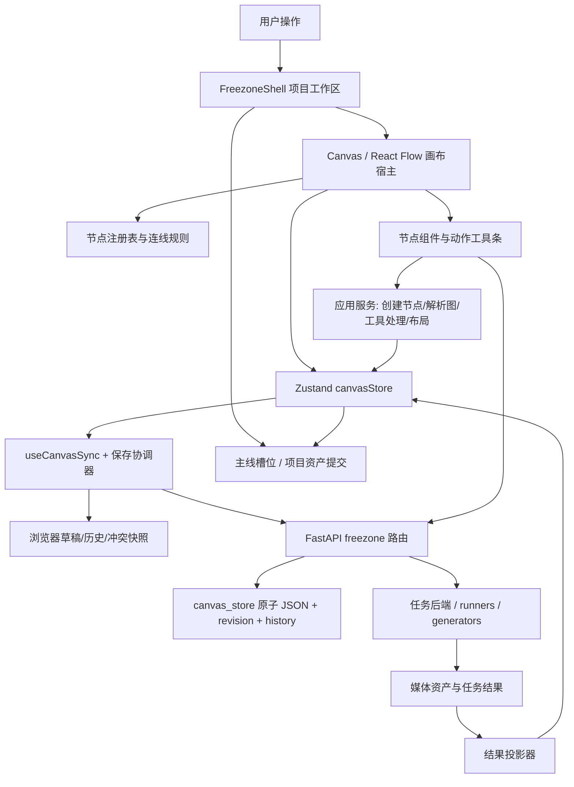

# 画布功能架构与安全扩展指南

> 最后复核：2026-09-19
> 适用范围：`frontend/src/features/canvas/`、`frontend/src/features/freezone/`、
> `frontend/src/stores/canvasStore.ts`、`src/novelvideo/api/routes/freezone.py`、
> `src/novelvideo/freezone/` 及相关任务执行链。
> 竞品能力差异、取证等级和路线图见
> [`liblib-canvas-parity.md`](liblib-canvas-parity.md)。

本文不是组件目录的复述，而是下一位开发者在改画布之前必须掌握的系统边界。画布同时承担
自由编排、媒体生成、异步任务、资产管理、草稿恢复和主线提交；一个看似只加按钮的改动，通常
会跨越节点契约、连线语义、任务协议、结果投影、持久化和恢复六层。没有先写清方案就直接改
`Canvas.tsx` 或 `NodeActionToolbar.tsx`，最容易制造重复入口、覆盖用户节点或无法恢复的半成品。

## 一、架构结论先行

1. **画布图是事实源，故事板、资产大纲和生成历史是派生视图。** 不要为每种视图各存一份图。
2. **生成和编辑默认产生下游派生节点。** 除纯布局、标题、批注等显式本地编辑外，不原地覆盖
   源媒体；源节点、参数、任务和产物必须可回看。
3. **节点类型描述“是什么”，动作描述“可以做什么”。** 不要继续靠一个巨型节点组件里的
   `if (type === ...)` 同时承担能力判断、交互、计费提示和任务提交。
4. **所有异步结果必须经类型化的结果投影器落图。** 禁止在 UI 里猜任意后端 JSON 的字段名。
5. **远端修订、浏览器草稿和本地文件三者都要可恢复。** 保存冲突不能靠最后写入者覆盖。
6. **新增功能先过“方案门”。** 先写节点/边/任务/结果/失败/恢复契约，再改代码；方案与验证
   记录进对应 `docs/agent/tasks/*.md`，长期取证放 `docs/guides/`。

## 二、系统全景



主调用方向应始终是“交互 → 应用动作 → 状态/任务 → 类型化结果 → 状态”。组件可以展示状态，
不应该自己发明任务协议或在多个地方复制结果解析逻辑。

## 三、前端分层与职责

| 层 | 主要位置 | 当前职责 | 修改边界 |
|---|---|---|---|
| 工作区编排 | `features/freezone/FreezoneShell.tsx` | 项目、画布同步、资产面板、主线投影、提交、聊天 dock | 只做跨功能组合，不沉淀单节点算法 |
| 画布宿主 | `features/canvas/Canvas.tsx` | React Flow、选择、缩放、框选、快捷键、菜单、LOD、小地图 | 不直接实现媒体任务；避免继续增大 |
| 图状态 | `stores/canvasStore.ts` | 节点、边、选择、工具态、overlay、撤销历史 | 状态变更要原子化；不做网络请求 |
| 领域契约 | `canvas/domain/canvasNodes.ts` | 节点联合类型及持久化字段 | 字段必须有版本/缺省语义，禁止随手塞临时 UI 状态 |
| 节点能力 | `canvas/domain/nodeRegistry.ts` | 定义、能力、上下游白名单、系统边、可派生类型 | 新节点或连线先在此声明，不在组件中旁路 |
| 节点表现 | `canvas/nodes/*` | 图片、视频、音频、脚本、分镜、技能等卡片 | 只消费领域状态和动作，不重复任务协议 |
| 节点动作 | `canvas/ui/NodeActionToolbar.tsx` 及 editor/overlay | 当前选中节点的编辑/派生入口 | 应逐步迁到统一动作注册表，组件只负责渲染 |
| 应用服务 | `canvas/application/*`、`canvas/infrastructure/*`、`canvas/tools/*` | 节点工厂、引用、布局、帧截取、拉片、任务结果处理 | 可单测的业务流程放这里 |
| 同步恢复 | `features/freezone/useCanvasSync.ts`、`canvasSyncCore.ts`、`canvasSaveCoordinator.ts`、`canvasDraftStorage.ts` | 自动保存、revision、草稿、冲突恢复、历史 | 所有持久化都走同一协调器 |

目前 `canvasNodes.ts` 声明 19 类节点：上传、图片、图片生成、图片导出、节拍上下文、文本批注、
分组、故事板、故事板生成、视频、音频、视频故事、视频合成、脚本、360 全景、3D 世界、技能、
风格和 LibTV 惰性素材节点。它们不是 19 套完全独立的页面，而是共享图、引用、任务与保存底座。

## 四、后端分层与职责

| 层 | 主要位置 | 职责 |
|---|---|---|
| HTTP 契约 | `src/novelvideo/api/routes/freezone.py` | 校验请求、创建任务、画布 CRUD/历史/导入、模型与资产目录 |
| 画布存储 | `src/novelvideo/freezone/canvas_store.py` | 原子 JSON 写入、互斥、revision、幂等键、历史、墓碑与裁剪 |
| 任务执行 | `src/novelvideo/task_backend/` | 任务生命周期、队列、runner 调度和结果发布 |
| 媒体实现 | `src/novelvideo/generators/`、`src/novelvideo/ports/` | 供应商/本地生成、编辑与存储边界 |
| 质量与合规 | `src/novelvideo/verification/` 及任务门 | 输入/输出检查、失败语义和可审计记录 |

`freezone.py` 已经同时承载上传、图像/视频/音频生成与编辑、拉片、脚本、目录、画布、历史、导入、
主线提交等大量接口。新增大能力时优先拆 service 或专用 route module；继续把业务状态机放进这个
路由文件，会令单测只能走大范围集成，且不同工作线极易冲突。

## 五、节点、边和派生产物

### 5.1 节点是可恢复的业务记录

一个可执行节点至少应能回答：输入是什么、用户选了什么参数、调用了哪个能力、任务当前状态、
结果是什么、失败后如何重试。只把最终 URL 存进节点，会丢失可追溯性；把临时 hover、弹窗开关
写进持久化数据，则会污染协议。

建议把字段分成四组理解：

- 身份与展示：节点 id、类型、标题、尺寸、位置。
- 领域输入：源资产、提示词、引用、时间区间、模型参数。
- 执行记录：任务 id、能力 id、状态、错误码、提交时的不可变参数快照。
- 产物：本地化资产、媒体元数据、版本和来源关系。

### 5.2 边不是装饰

`nodeRegistry.ts` 的上下游白名单和系统边决定了输入是否有效。重拍、续写、拉片、高清、抠图等
派生动作，边同时承担数据来源和审计关系。删除边或替换源素材后，目标节点必须能判定绑定失效，
而不是继续拿旧 URL 生成。

边的语义至少分三类：

- 用户编排边：用户表达顺序或引用，可被手动调整。
- 数据依赖边：任务提交前必须存在并校验源版本。
- 系统派生边：由动作创建，用于追溯，不应被普通自动布局误改方向。

### 5.3 派生优于覆盖

媒体高清、分离、重拍、续写、主体消除、图层分离等操作都应默认创建下游节点或版本化文档。
只有用户明确选择“替换”且存在撤销/历史时，才允许修改原节点。这个约束也是我们与竞品可以
保留的产品差异：画布不仅要快，还要让生成过程可解释、可对比、可复用。

## 六、四条关键链路

### 6.1 本地编辑与自动保存

1. 交互调用 store 的领域动作，一次提交完整状态变化。
2. store 写入撤销历史；当前上限为 50 步。
3. 浏览器草稿约 300ms 防抖落盘，远端保存约 800ms 防抖发起。
4. 保存携带 revision 与 `client_save_id`；服务端用 revision 防覆盖、用 id 保证幂等。
5. 遇到 409，不静默覆盖，进入冲突恢复：保存副本、下载本地 JSON 或重新加载远端。
6. 空图写回受危险清空保护；只有明确的手动清空或投影移除意图才允许覆盖已有图。

这些不变量不能因“只加一个节点”而绕过。任何直接请求画布 PUT 的新代码都要视为缺陷。

### 6.2 生成任务

1. 从目录和节点能力选出支持当前模式的模型。
2. 提交前校验源资产、本地化状态、时长/数量/比例、引用和计费可见性。
3. 创建任务并把不可变提交快照写入节点。
4. 任务中心/轮询接收进度；取消、失败和重试必须有稳定状态。
5. 结果经类型化 projector 转成资产和节点更新。
6. 保存图；如需进入项目主线，再走显式 commit，不把“画布产物”和“主线采用”混为一步。

### 6.3 派生工具

以逐帧拉片为例：源视频 → 新建拉片节点/绑定源边 → 选择分镜、动态、音乐维度 → 创建任务 →
流式写回各维度产物 → 分组和布局。入口点击只应建立可编辑草稿；真正提交前再消耗积分/资源。
如果工具在点击入口时就直接创建节点，界面必须提供撤销或明确的空草稿清理规则。

### 6.4 提交到主线

画布允许分叉和试验，项目主线需要稳定槽位。`FreezoneShell` 中的投影/commit 桥负责把选定产物
送入主线。动作要记录目标槽位、来源节点/资产和结果，不能把所有“最新生成”自动当成主线版本。

## 七、恢复、并发与数据安全不变量

- 服务器画布是带 revision 的事实源；浏览器草稿是恢复层，不是无条件覆盖源。
- 所有保存必须串过保存协调器，保证同一时刻的请求次序可判断。
- 冲突时保留两份内容，让用户选择，不做 last-write-wins。
- 删除节点不等于立刻物理删除资产；共享资产的引用计数/影响范围要先评估。
- 外部导入素材在服务端任务前必须本地化；远端 URL 不应穿透同源和签名边界。
- 密钥、签名 URL、机器绝对路径不进画布 JSON、台账和公开文档。
- 收费/高成本动作必须在提交前显示模型、预计消耗和输入范围，不能用静默兜底换模型或模式。
- 供应商不可用时返回稳定错误码，前端三语映射；不把后端原始中文或堆栈直接显示给用户。

## 八、性能边界

大画布性能不是单一渲染问题，至少包括：视口外节点剔除、低缩放 LOD、视频封面而非持续解码、
节点 payload 懒加载、生成历史分页和大图资源释放。现有 `Canvas.tsx` 已有 LOD class、小地图和
懒加载接点，但完整 payload 仍随画布文档增长。

建议演进方向：

1. 图骨架只保存布局、轻量摘要、能力和 payload version。
2. 大型脚本、图层文档、分析结果按节点 payload 独立读写。
3. 视口内或选中时才加载重 payload，离开视口释放媒体解码器。
4. payload 保存也带 revision，不允许图骨架和 payload 互相静默覆盖。

这是中长期改造；不要为了模仿 LibTV 的接口名字，一次性迁移现有格式。

## 九、新动作统一契约（建议先做）

当前 `NodeActionToolbar.tsx` 同时负责按钮展示、节点创建、任务提交、结果解析和提示。再直接加入
“创意片头”“主体消除”“音频切分”等按钮，会把同一套校验复制到更多分支。建议先建立统一的
`CanvasActionDescriptor` 注册表，概念契约如下：

```ts
type CanvasActionDescriptor = {
  id: string;
  sourceTypes: CanvasNodeType[];
  effect: "preview" | "spawn" | "mutate" | "paid-job";
  capability?: string;
  isAvailable(context: CanvasActionContext): Availability;
  prepare(context: CanvasActionContext): Promise<PreparedAction>;
  submit?(prepared: PreparedAction): Promise<TaskReference>;
  project?(result: TypedTaskResult): CanvasGraphPatch;
  recover?(snapshot: ActionSnapshot): RecoveryPlan;
};
```

注册表需要集中回答：

- 哪些节点能看到动作，禁用原因是什么；
- 是预览、派生、原地变更还是收费任务；
- 模型/版本/权限/时长/本地化等前置条件；
- 创建哪些节点和边，失败时保留或回滚什么；
- 任务结果的确定类型及如何投影；
- i18n key、埋点、快捷键和帮助文档。

工具条、右键菜单、命令面板和 Agent 都应消费同一动作定义。这样“按钮能点”和“Agent 能调用”
不会发展成两套实现，也能阻止不支持的模型被静默提交。

## 十、故事板与 Agent 的正确接入方式

LibTV 的故事板模式证明，全局媒体审阅比在无限画布里逐个找节点更高效。但我们不应复制第二份
持久化状态：第一阶段把故事板实现成图的只读投影，按连线/分组/空间位置推导顺序，只保存用户
显式修改的排序 override。故事板中的替换、批准和生成仍调用统一动作注册表。

Agent 也不应直接改 React Flow 数组。Agent 输出应是可审阅的 `CanvasEditPlan`：新增/更新/删除
哪些节点与边、预计调用哪些收费动作、影响哪些主线槽位；用户批准后由同一命令层执行。这样既能
支持自然语言编排，又保留撤销、权限、冲突检测和审计。

## 十一、技术债与冲突热点

以下文件规模大且跨工作线高频修改，是“整文件覆盖”高风险区：

| 文件 | 约行数（2026-09-19） | 风险 | 建议拆法 |
|---|---:|---|---|
| `Canvas.tsx` | 5,252 | 交互、选择、渲染、菜单、LOD 混合 | controller hooks + view layers |
| `VideoNode.tsx` | 4,481 | 播放、生成、编辑状态机混合 | player / generation / derived-action adapters |
| `NodeActionToolbar.tsx` | 2,823 | 展示与业务编排混合 | 动作注册表 + 纯工具条 renderer |
| `ImageGenNode.tsx` | 2,793 | 生成、编辑、引用、展示混合 | image session + presentation |
| `VideoComposeModal.tsx` | 2,786 | 时间线、预览、导出混合 | typed tracks + compositor adapter |
| `VideoOperationsPanel.tsx` | 2,473 | 多种视频任务共用条件分支 | per-action schemas |
| `AssetLibraryPanel.tsx` | 2,397 | 浏览、管理、替换、拖拽混合 | query/model + action views |
| `useCanvasSync.ts` | 2,248 | 加载、草稿、冲突、保存混合 | load/save/conflict state machines |
| `freezone.py` | 14,648 | 路由和业务规则高度集中 | 按 canvas/media/catalog/commit 拆 route/service |

这些数字用于识别风险，不是要求一次重构。功能改动采用“先抽当前要复用的契约，再加能力”的
渐进策略，禁止无关格式化或整文件重写。

## 十二、改代码前的方案门

每个新画布能力在实施前，至少把下表写入对应工作线台账或专项方案：

| 必答问题 | 最低答案 |
|---|---|
| 用户入口 | 哪类节点、工具条/菜单/Agent，何时显示或禁用 |
| 数据模型 | 新增/复用什么节点字段，是否版本化，旧数据如何缺省 |
| 图语义 | 新增哪些节点和边，源被删/换后怎样失效 |
| 能力门控 | 哪个目录 capability、模型、版本、权限和输入限制 |
| 任务协议 | 请求 schema、幂等键、计费时点、取消与超时 |
| 结果协议 | 明确结果类型、资产本地化、如何投影和命名 |
| 失败恢复 | 提交前失败、任务失败、保存冲突分别保留什么 |
| 覆盖风险 | 会碰哪些热点文件、与哪条工作线重叠，如何分 hunk |
| 验证 | 纯逻辑、组件、API 契约、刷新恢复、真实任务各测什么 |
| 文档 | 台账决策、长篇方案、三语文案和用户帮助是否同步 |

没有这些答案时可以做只读取证或原型，但不应接入生产任务按钮。

## 十三、推荐验证顺序

1. 纯函数和领域契约单测：区间、边绑定、投影器、迁移。
2. 节点/工具条组件测试：可见性、禁用原因、创建节点和撤销。
3. API 契约测试：请求 schema、稳定错误码、幂等与权限。
4. 同步恢复测试：刷新、断网、409、草稿和危险空图。
5. 干净快照执行 `cd frontend && pnpm build` 与相关 `pnpm test`。
6. 真实浏览器从入口走到任务结果；收费动作先用最小素材，并记录是否真正扣费。
7. 更新台账：文件/行为、分叉理由、命令和界面结果；未跑真实供应商就明确写“未验证”。

常用门禁仍以仓库根 `AGENTS.md` 为准，至少包括前后端 i18n 棘轮、ruff、相关 pytest、前端
build 和 gitleaks。文档不能把环境阻塞写成代码已验收。

## 十四、接手导航

- 当前工作线和冲突：`docs/agent/STATE.md`
- 本次竞品线决策与进展：`docs/agent/tasks/liblib-canvas-parity.md`
- LibTV 真实界面、chunk 证据和差距：`docs/guides/liblib-canvas-parity.md`
- 视觉规则：`DESIGN.md`
- 画布节点领域模型：`frontend/src/features/canvas/domain/canvasNodes.ts`
- 节点注册/连线：`frontend/src/features/canvas/domain/nodeRegistry.ts`
- 保存恢复：`frontend/src/features/freezone/useCanvasSync.ts`
- 后端持久化：`src/novelvideo/freezone/canvas_store.py`

遇到旧方案与当前代码冲突时，优先顺序是：台账中“已定下来的决策” → 当前测试契约 → 本文架构
不变量 → 历史取证。不要因为竞品后来改了按钮位置，就反向推翻我们已经验证过的数据模型。
