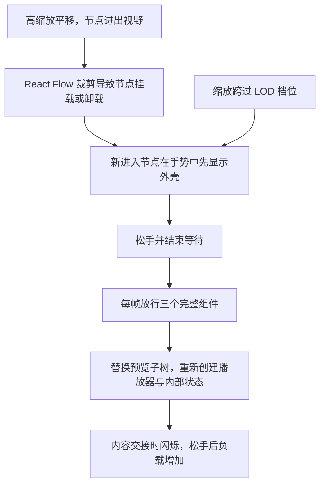

# 工作流画布拖动卡顿与闪烁：LibTV 对照分析及实现方案

日期：2026-09-27
代码基线：`4c9dee4`，`codex/sync-main-remotes`
交付范围：分析与方案。初次取证后，`liblib-canvas-parity` 已实施视频封面预览，`canvas-lod-perf` 已实施手势结束保护与视口通知去重。本轮继续深入 LibTV 的节点和拖动机制，仅更新文档。以下最新深入对照优先于历史分析和旧实施顺序。

## 最新深入对照：节点、预览交接与拖动归属（2026-09-27）

### 1. 结论与证据边界

本轮复用 Chrome 中已登录的 LibTV 来源画布，实际执行空白区平移和缩放，读取渲染 DOM、可访问的页面 CSS 规则和计算样式；没有读取私有 React 状态、后台源码或账户凭据，没有移动节点或提交生成。

**最明确的新差异是“预览交接”和“拖动命中处理”，不能再把所有问题解释成 React 反复重建。**

- LibTV 也采用 React Flow、简化节点、视口裁剪和缩放时的组件替换。因此，“LibTV 不用 React / 不裁剪 / 所有节点永远不换 DOM”均不成立。
- LibTV 在简化预览切换到完整节点时，实测保留旧缩略图覆盖层，随后淡出，最后移除。本地 `withLodShell` 直接在两套子树之间切换。
- LibTV 的抓手模式明确让节点、子元素、连线及句柄不接受鼠标命中，统一由画布处理；拖动中还暂停多种生成动画。本地抓手主要关闭节点拖动/选择，仍挂着 hover 回调和额外的连线平移入口。
- 本地此前约 22% 的持续平移已经观测到节点、图片、几何和路径稳定。预览交接修复能覆盖跨档位与边界新节点，**不能据此宣称已解释这次低缩放持续闪烁**。
- 本轮本地诊断页多次被 Chrome 的其他扩展界面阻止操作，未取得新的本地同轨迹帧时间。此前正常/无连线/无媒体/整幅隐藏模式均出现约秒级调度间隔，不能拿它们估算真实 FPS，也不能认定 GPU、网络或 SVG 为唯一根因。

### 2. LibTV 的实际渲染形态

节点数是当前 DOM 挂载数，不是“导入丢失数”。缩放和视野不同，不能直接比较两张表的总耗时。

| LibTV 观察状态 | 节点 | 图片 / 视频元素 | 媒体预览形态 | 连线 SVG |
|---|---:|---:|---|---:|
| 本轮初始约 13.7% | 112 | 91 / 0 | 图片、视频为 `node-skeleton`；文本有正文排版 | 1 |
| 50% 静止区域之一 | 24 | 16 / 0 | 完整节点仍是静态封面 | 1 |
| 50% 平移另一位置 | 20 | 14 / 0 | 视频节点每个约 34 个后代元素 | 1 |
| 从高缩放退到 22% 后 | 53 | 43 / 0 | 观察到完整媒体节点，封面长边 200px | 1 |
| 10% 静止 | 128 | 102 / 0 | 102 个媒体简化节点，每个约 8 个后代元素；文本仍排版 | 1 |

10% 封面实际解码尺寸主要为 `100×42`、`100×43`、`100×56`；22% 观察到 `200×85`；50% 观察到 `400×171` 和 `500×214`。这是页面图片元素的 `naturalWidth/Height`，不是从 URL 猜测。

同为约 14%：从 50% 缩小后曾保持完整节点，从 10% 放大后保持简化节点；从低缩放继续到 22% 也曾保持简化节点。这说明节点形态与缩放历史/生命周期有关，不能只看单个比例推断阈值。具体滞回阈值与调度算法没有取得源码，不在报告中虚构。

在观测的 10%/14%/22%/50% 稳态快照中，挂载节点的矩形均与屏幕相交，没有观测到明显的屏幕外预留带。50% 平移时挂载数量会变化，新进入节点可先以简化预览出现。因此，**“LibTV 用大范围 overscan 所以稳定”没有证据**。本文后面提出的缓冲方案是本地候选优化，不是复刻已知 LibTV 参数。

### 3. 实测到的缩略图交接：直接解决一类空闪

从低缩放逐步升到 50%，连续采样捕捉到：

1. 简化节点显示现有缩略图。
2. 16 个可见媒体节点升级，出现 `.node-skeleton.node-thumbnail-handoff`。
3. 每个交接节点的同一父级同时有两张图片：完整节点图片与旧预览覆盖图；覆盖图 `complete=true`。
4. 覆盖层加上 `.node-thumbnail-handoff--fading`。
5. 淡出层移除，完整节点继续显示；节点外层内联几何保持稳定。

读到的页面样式：交接层绝对定位、`z-index:20`、不接收指针事件，透明度过渡 `0.12s ease-out`；淡出类透明度为 0；减少动效偏好下取消过渡。观察证明“旧预览覆盖 → 淡出 → 移除”存在；内部是否用 `decode()`、`load` 或其他就绪信号，未取得私有源码，不能确定。

本地对应落点：

- `nodes/LodShellNode.tsx:249` 的 `withLodShell`，在约 299 行分支直接返回 `LodShell` 或 `Component`，没有上一张成功预览交接层。
- `application/canvasLod.ts` 每帧放行 3 个升级，已经能摊开挂载成本；它保证的是调度，不保证新内容第一帧已经可见。
- `ui/CanvasNodeImage.tsx:40` 直接用传入 `src`；没有“保留旧图直到新图就绪”的状态。
- `nodes/VideoNode.tsx:3519` 已为显式播放做封面到视频首帧交接；这个保护位于完整组件内部，不能覆盖外层 shell/full 切换。

建议先做窄修：媒体节点升级前保存当前已显示封面与外框；完整预览报告就绪前旧图保持可见，随后原位移除/短淡出。失败保留旧图，连续缩放可取消旧交接，素材变更按版本失效。覆盖层不能复制第二套句柄、加入尺寸测量或接收点击。无需先重写所有节点组件，也不需要改节点坐标。

### 4. 抓手模式：LibTV 让拖动事件直接落到画布

可访问的页面 CSS 明确包含这些行为：

| 条件 | LibTV 行为 |
|---|---|
| `.react-flow.hand-tool-mode` | 节点及其所有后代、边容器、边及后代、简化句柄均 `pointer-events:none !important` |
| `.canvas-interacting` | 节点和边停止命中；多种进度呼吸、文字闪光、发光边框动画暂停 |
| 拖动时 | 普通连线流动段隐藏/暂停，显式保留的流动段例外 |
| 特效降级 | 针对发光背景层清除 filter；没有读到本地这种 viewport 全体后代统一清除 filter 的规则 |

50% 两次平移采样中，外层只在拖动期增加 `canvas-interacting`，pane 带 `dragging`；被观察视频图片保持 `filter:none`、`opacity:1`、`object-fit:cover`，没有反复改图片样式。

本地源码链条：

1. `Canvas.tsx:5004` 关闭 `nodesDraggable` / `elementsSelectable`，但仍传入 `onNodeClick/onNodeMouseEnter/onNodeMouseLeave`。
2. 安装的 React Flow `NodeWrapper`（约 2140 行）只要有上述回调就认为节点需要指针事件，因此不能把“不可拖、不可选”等同于“鼠标不再命中”。
3. `Canvas.tsx:927` 的 hover 回调无平移守卫，会写 `hoveredNodeId`；`NodeSpawnPlusOverlay` 只在拉线等场景隐藏，普通平移未统一停掉 hover/磁吸反馈。
4. `index.css:710` 的抓手规则只改光标；`index.css:852` 的平移规则主要全局关阴影/模糊/filter。
5. `Canvas.tsx:2099` 对连线路径额外监听 pointer 事件并程序化移动相机。上一轮已经补同帧合并和结束保护，但仍是独立入口。

建议：先在**明确抓手模式或已认领的画布平移手势**中暂停节点/边命中与 hover，清除悬停延时、关闭加号磁吸反馈，把拖动交给 pane。移动工具、选框、参考拾取、端点重连和节点内部控件保留各自语义。中键/空格路径要固定手势 owner，不能在按下后抢走正在操作的节点。确认这些路径接管正常后，才能删除对应重复连线平移入口。

这是有依据的事件路径简化；本轮没有记录 LibTV 私有事件监听器，不能断言它内部只有一个 JavaScript handler，也不能把 CSS 差异直接等同于已测得的帧率收益。

### 5. 连线：共享 SVG 是事实，性能收益仍需单独证明

LibTV 的 `react-flow__edges` 下为一个 `svg[data-shared-edge-layer]`，每条边一个 `g`，通常含可见与命中两条 path。它仍做边可见性裁剪：本轮区域中出现过 136、187、236 条边；概览为约 511–513 条。不同时间的细微数量差异不能用来判定本地少导入/多导入。

本地安装的 React Flow `EdgeWrapper` 每条边直接返回一个 SVG，128 节点概览实测 512 个 SVG / 1024 条 path。仅把 `DisconnectableEdge` 内部改为共享组件，**不会自动消除外层每边一个 SVG**。

本轮 50% 平移采样中，持续存在的 LibTV 路径大多不改 `d`；一次边界变化时有 3 条存续路径变化，同时大量离屏路径卸载。不能声称所有路径永远缓存不重算。两边静止 viewport 均为普通 translate/scale，`will-change:auto`；DOM 中没有证据支持“LibTV 全画布画在 Canvas/WebGL 上”或“512 SVG 就是 512 个 GPU 层”。

推荐独立做共享边层原型，用开发开关与原实现比较：图数据仍只存一份；普通被动边在单个视口 SVG 绘制，选择/重连/工具提示等交互仍须保留。路径缓存按端点位置、句柄、路由方式和层级失效，平移不重算；只画两端都在屏幕内会漏掉穿越屏幕的边。不得为减少 SVG 直接删数据边，或把空 SVG 包装层留着就宣称完成优化。

### 6. 素材尺寸与文字预览：还有两处呈现差异

**图片大小：**本地已经有 `thumb=320`、`thumb2x=640`、`card=1280`，见 `lib/media-url.ts:42`。若沿用部分旧注释认为“只有 320 一档”会重复实现。`useNodeBodyVariantBudget.ts` / `imageData.ts` 的文字说明有历史残留，以实际 `pickMediaVariant` 为准。

本地 shell 已挑图片变体；完整视频的 `lodPoster`（`VideoNode.tsx:1923`）直接解析封面并用于 `img`，没有调用这一套变体预算。这条完整视频预览分支可补齐按显示像素选图，并与交接保护一起做。LibTV 的 100/200/400px 阶梯比本地更细，但不能只改 URL 参数而不补本地后端缓存支持；第一步优先复用已有三档。

**文字：**LibTV 低缩放实测保留 Markdown 排版；本地 shell 把正文裁到 1200 字并当纯文本显示，字号、行距、内边距与完整文本不同。这会让跨档位时“文字看起来变大小/跳排版”，即使相机 scale 没错。建议共享只读正文排版和固定外框，编辑器仅在编辑时激活。这里应区分“文字外观跳变”和“真实相机缩放”。

### 7. 拖节点与平移画布是两条不同成本链

本轮没有移动 LibTV 的业务节点；以下节点拖动成本为本地源码确认，尚无同动作的 LibTV 内部耗时对照。

```text
平移画布：pointer → 相机 transform → 可见集合/绘制 → 结束时保存视口
拖动节点：pointer → 节点 position → 图订阅/连线路径/吸附 → 结束时撤销和保存
```

本地已有合理保护：未变节点对象复用、上游列表 `useShallow`、吸附索引在拖动会话内复用、组框主要松手后 refit、一次拖动记录一次撤销。应保留这些机制。

仍存在的具体开销：

- `application/useUpstreamGraph.ts:26` 返回完整上游节点对象。移动一个上游素材会替换它的节点对象，即便 `data` 没变，引用它的可见下游也会重新得到数组，继而重算引用/内容。这与“拖动无关节点可跳过渲染”的现有优化不矛盾。
- `nodes/referenceOrdering.ts:24` 每个订阅计算都会新建全量 node Map 并过滤 edges；`useShallow` 避免 React 提交，不会消除 selector 本身的计算。
- `Canvas.tsx`、`SelectedNodeOverlay.tsx`、`NodeSpawnPlusOverlay.tsx` 仍有整张 nodes 数组订阅；普通节点拖动会触发它们的计算。不能把文件长或 hook 多直接当作耗时证据，但有必要用 Profiler 拆分计数。
- `useCanvasSync.ts:1467` 在 nodes/edges 改变时计算内容签名，然后才延迟保存。已有 WeakMap 缓存未变节点；被拖节点每帧是新对象，约 347 行仍重新 stringify 它的 position 与 data，同时拼接全图分片字符串。不是“每帧完整 stringify 所有节点”，但大提示词节点仍有不必要重复序列化。
- 联动拖动与 Alt 复制拖动有额外的节点变更批次；这些是业务语义，不能为了减少次数直接删除。

建议让“引用素材订阅”只依赖 ID、类型和相关 data 的稳定投影，几何变化单独供连线/布局使用；按 graph revision 共用 ID/入边索引，不能在每个节点里各建一个 Map。保存侧把内容指纹与几何指纹分开，位置变更不要重复序列化大段提示词；按帧或手势结束合并签名工作，并保留失焦、异常退出、beforeunload 的草稿保护。不要推迟真正的相机/节点位置响应。

### 8. 修正后的实施顺序与验收

| 顺序 | 窄范围改动 | 主要文件 | 验收依据 |
|---|---|---|---|
| 1 | 抓手命中透传、平移中冻结 hover/加号，统一事件归属 | `Canvas.tsx`、`index.css`、`ui/NodeSpawnPlusOverlay.tsx` | 抓节点表面/密集连线/空白均只平移；节点位置/引用不变；选择/重连正常 |
| 2 | shell/full 媒体交接 + 完整视频封面变体 | `nodes/LodShellNode.tsx`、`nodes/VideoNode.tsx`、可复用预览组件 | 跨档位/进出视野先有旧图再有新图；新图失败不空白；未播放视频仍为 0 |
| 3 | 固定文本预览排版；分离参考内容与几何订阅 | `application/useUpstreamGraph.ts`、文本节点、引用使用点 | 拖上游素材不重算下游提示词；正文布局稳定；引用顺序/编号不变 |
| 4 | 合并拖节点的内容签名计算 | `features/freezone/useCanvasSync.ts`、必要的 store 接点 | 长文本节点拖动期间不重复序列化正文；松手只完成一笔撤销；退出可恢复 |
| 5 | 共享 SVG 的可回退原型与同轨迹比较 | 新边绘制层、`Canvas.tsx`、现有边交互 | DOM 包装层确实下降，交互完整；证明 Paint/Composite 或视觉闪动改善后才推广 |
| 6 | 如高缩放边缘仍闪，再做有界预览缓冲 | 可见性预算模块、节点预览 | 缓冲内实例复用且内存有界，不改变画布坐标 |

前两项可逐项独立交付，不必先重写画布框架。当前 React Flow、生成链路、图数据、分组/节点几何及已实现的封面与手势修复继续复用。也不建议直接降低 LOD 阈值或全部重组件常驻，那只会把成本转移到另一个缩放档位。

验收必须分别覆盖：低缩放持续平移、跨 LOD 档位、高缩放节点进出边界、移动高引用数素材节点；每项记录 DOM 身份、图片切换、真实几何、相机 scale、React 提交与浏览器帧时间。纯平移不应产生图内容保存；节点拖动只更新必要节点/连线及最终保存。

**本轮交付为取证与方案，未新增业务代码、测试或构建。**LibTV 已恢复到原区域附近的 14% 概览；原比例为约 13.7%。未修改节点数据。本轮源码与浏览器证据足以给出上述窄修优先级，但不足以宣布“持续低缩放闪烁已定因/已解决”。

## 最新补证：封面调整后仍闪烁（2026-09-27）

本节优先于后文初次取证的归因和实施顺序。后文 50% 视频播放器数量是封面调整前的历史数据。

### 录屏与实际页面

用户提供约 21.7 秒手机录屏，前段展示本地，后段展示 LibTV。录屏包含拍摄屏幕的抖动和压缩，不能据此计算可靠帧率，也不能仅凭亮度变化认定 React 重新挂载。随后在 Chrome 实际本地画布约 22.3891% 缩放下进行平移采样。

| 检查 | 当前本地实测 |
|---|---|
| 节点 / 简化预览 | 128 / 113，采样中数量不变 |
| 图片 / 视频元素 | 102 / 0 |
| 节点与其第一层内容元素身份 | 连续 30 次采样中未观察到替换 |
| 图片元素身份、地址、内联样式、class | 未观察到变化 |
| 节点内联宽高 | 未观察到变化 |
| 连线路径 | 1024 个 path 的元素、d、内联样式、class 未观察到变化 |
| 相机 | translate 变化，scale 始终为 0.223891 |
| 外层样式 | 平移时增加 `dc-canvas--panning`，结束后移除 |

两组 DOM 采样各约 1.5 秒、间隔约 50ms，覆盖一次平移及前后状态；这是采样证据，不能排除采样间的瞬时变化，也不能等同 React Profiler 的 render 次数。本地最终恢复到采样前的视口位置；LibTV 本轮仅读取 DOM。

**结论：当前低缩放复测不支持“节点不断销毁重建”“图片地址反复刷新”“平移自动缩放”的解释。** 后文 shell/full 替换确实是高缩放进出视野和跨档位的问题，但不能拿它解释本次持续处于 22% 的平移。上一轮视频封面改动主要覆盖普通视频节点的播放器生命周期；低缩放在改动之前就使用封面，因此这一档仍闪烁并不矛盾。

### 连线组织方式有明确差异

| 页面 | SVG 容器 | 路径 | 观察到的结构 |
|---|---:|---:|---|
| 本地 | 512 | 1024 | React Flow 每条边一个独立 SVG；可见路径与透明命中路径各一条 |
| LibTV | 1 | 1022 | `data-shared-edge-layer` 的共享 SVG 内包含各边分组 |

本地当前导入画布主要使用默认边，可见路径宽度为 1.5 个画布单位；LibTV 为 2。两者都随 viewport 缩放，密集细线的亚像素绘制可能产生明暗变化，但这仍是待验证假设。SVG 容器数量不等于 GPU 图层数量，不能从 512 对 1 推导速度倍数或直接认定闪烁根因。

本地 viewport 与 LibTV 都使用二维 translate/scale；观察时二者 `will-change` 都为 auto。因此不能声称 LibTV 仅靠一个 `will-change: transform` 就解决了问题。

### 下一步实施顺序修正

1. 先在诊断开关下记录 React 提交、浏览器 Paint/Raster/Composite 帧耗时，并以相同缩放、视野和拖动轨迹比较开发 / 生产构建。当前工具未取得 Performance 轨迹，不能声称已测得实际绘制耗时。
2. 对密集连线做可恢复的 A/B：正常显示与临时隐藏连线，观察闪动是否随之变化；再评估共享 SVG 的原型。正式替换必须保留命中、断开、重连、选择、层级、箭头与拖动语义，不修改 `node_modules` 或连线数据。
3. 分别检查开始 / 停止拖动时的全局样式切换。低缩放本来已关闭阴影和背景滤镜，不能把本档所有闪烁泛化为阴影恢复；应核对实际发生变化的 computed style。
4. 高缩放和跨档位继续执行稳定预览与缓冲裁剪方案，作为另一组独立验收用例。

这轮只更新诊断报告。尚未声称消除用户录屏中的闪烁，也没有提供未经实测的 FPS 改善数字。

## 1. 结论

建议继续使用现有 React Flow，把改造重点放在 **稳定的节点外框、常驻的静态预览、按需创建播放器、独立的视口状态** 上。

本地已有不少性能优化，但它们目前组合成了两套明显不同的显示生命周期：低缩放显示轻量外壳，高缩放换成完整业务组件；高缩放的视口裁剪又会反复销毁和创建这些组件。用户看到的内容变化，可能发生在相机缩放值完全没变的时候。

本次确认的主要问题与边界：

1. **视频预览策略差异明确。** 50% 缩放时，本地一处视野挂载 16 个暂停的视频元素；LibTV 已观察视野挂载 21 张图片、0 个视频元素。LibTV 当前的未播放视频以静态预览展示，本地高档位会直接创建播放器。
2. **节点内容替换已经观察到。** 本地从约 22% 放大至 50% 时，出现过短暂仅有分组背景的画面，随后节点内容恢复；50% 平移过程中，有新节点先以外壳出现，静止后再成为完整组件。源码与这条生命周期吻合。
3. **平移仍有与图内容无关的计算。** 本地每约 120ms 把视口写入图状态；自定义 `DisconnectableEdge` 的 selector 随之执行两次节点数组查找。当前导入画布主要使用默认边，不能把这项自定义边成本乘以全部 512 条边。memo 阻止部分重新渲染，但阻止不了已订阅 selector 本身执行。
4. **连线平移是第二套手势实现。** 每次指针移动直接调用 `setViewport`，没有帧合并。它复用了程序化视口事件，却没有小地图平移已有的结束提交保护。触控板平移开关会改变结束事件的合并行为。
5. **“平移导致相机自动缩放”尚未在本轮样本中复现。** 两次本地空白区域平移的 scale 分别稳定为 `0.223891` 和 `0.5`。需要分别诊断真实相机变化、节点尺寸变化、预览/完整内容变化；不能把三者混为一谈。

因此，优先处理播放器与外壳替换，再处理视口和连线热路径。仅调整一个缩放阈值，或者给全部节点加 memo，不能解决当前链条。

## 2. 取证范围与可信度

### 2.1 方法

- 使用 Chrome 中已登录的两个实际页面，执行概览档位平移、设置 50% 缩放及空白区域平移。
- 读取公开页面 DOM：React Flow 的 viewport transform、节点/边/图片/视频数量，以及本地外壳数量。
- 阅读本地 Canvas、节点组件、LOD 状态、连线、状态库和保存逻辑。
- 核对本机安装的 `@xyflow/react` 与 `@xyflow/system` 源码，确认裁剪和程序化视口事件行为。
- 已恢复本地原始 transform；LibTV 恢复到约 23% 的原概览范围。未移动节点、修改文本、调用布局或提交生成。

### 2.2 限制

- LibTV 的判断基于实际页面行为与公开 DOM，没有获得其私有 React 源码，不能断言它内部使用何种缓存或缓冲区算法。
- 两个页面的可视尺寸与视野范围不同。节点数量用于解释渲染结构，**不用于宣称性能快了几倍**。
- 本地运行的是 Vite 开发页面，对照是线上页面。下一阶段必须补生产构建对照，开发环境差异也会影响耗时。
- 本轮没有取得完整 Performance 轨迹或 React Profiler 数据，未测得可靠 FPS、长帧分布、解码耗时或 GPU 占用。代码里的历史帧率注释不是本画布的新测试结果。
- 本轮未改业务代码，未运行单元测试或构建；下文验收矩阵是实施阶段需要执行的内容。

## 3. 页面观察记录

数量为采样时 DOM 中已挂载的元素，包含视口外仍保留的元素；并非所有行都是同一时刻、同一取景。

| 页面与状态 | 缩放 | 节点 | 简化外壳 | 图片 | 视频元素 | 连线 |
|---|---:|---:|---:|---:|---:|---:|
| 本地初始概览 | 22.3891% | 128 | 113 | 102 | 0 | 512 |
| 本地升到 50% 的过渡采样 | 50% | 21 | 18 | 16 | 0 | 178 |
| 本地 50% 静置完成 | 50% | 21 | 0 | 未单独记录 | 16 | 未单独记录 |
| 本地 50% 平移中的采样 | 50% | 19 | 1 | 未单独记录 | 13 | 未单独记录 |
| 本地 50% 平移后静置 | 50% | 19 | 0 | 未单独记录 | 13，全部暂停 | 未单独记录 |
| LibTV 初始概览 | 23.5235% | 88 | 不适用 | 69 | 0 | 510 |
| LibTV 50% 静置 | 50% | 29 | 不适用 | 21 | 0 | 388 |
| LibTV 50% 横向平移后 | 50% | 29 | 不适用 | 21 | 0 | 327 |

补充观察：

- 本地约 22% 空白区向左平移 250px：x 从 `2019.07` 变为 `1769.07`，y 与 scale 不变。
- 本地 50% 空白区向左平移 400px：x 从 `2877.82` 变为 `2477.82`，scale 保持 `0.5`；过程中挂载数量和内容类型变化。
- LibTV 50% 向左平移 400px：x 从 `4671.02` 变为 `4271.02`，scale 保持 `0.5`，平移后仍无视频元素。中间采样未覆盖完整拖动过程，因此不声称捕获了其逐帧行为。
- 本地平移后 13 个暂停视频均没有 `poster` 属性。暂停并不等于没有播放器生命周期成本。
- 两边都有 `.react-flow__viewport`、`.react-flow__node`、`.react-flow__edge`。现象不足以支持改换画布引擎的必要性。

## 4. 本地实现与问题链条

以下行号以本报告基线为准。

### 4.1 高缩放把普通预览升级为播放器

文件：`frontend/src/features/canvas/nodes/VideoNode.tsx`

- 1898 行附近：`videoPosterSource` 虽然名称带 Poster，实际是带 `#t=0.1` 的视频 URL。
- 1910–1930 行附近：已经存在封面生成/缓存与 `derivedVideoPoster`。
- 3468 行附近：只有低细节且未播放时，才走静态图片预览。
- 3492 行附近：完整档位直接挂载 `<video src={videoPosterSource} preload="metadata">`，没有 `poster` 属性。
- 3513 行附近：媒体元数据加载后检查并写入素材宽、高和时长。

影响：

1. 每个普通可见视频节点都要创建媒体元素、绑定监听器并读取媒体信息，即使用户只想拖动查看画布。
2. 视口裁剪或 LOD 替换导致播放器重新创建；没有稳定图片覆盖加载阶段，首帧准备期间容易出现黑块或空帧。
3. 节点内部状态、测量与元数据事件可以追加渲染工作；实际耗时占比需要 Performance 轨迹确认。

`preload="metadata"` 不能把 `<video>` 变成轻量图片。反过来，不能仅凭 DOM 数量就断言每个视频占用多少解码内存或 GPU 图层。

**判断：源码与页面相互印证，优先级最高。**

### 4.2 LOD 替换整个节点内容，裁剪又触发重新挂载

文件：`frontend/src/features/canvas/nodes/LodShellNode.tsx`

- 256 行：订阅全局低细节布尔状态。
- 267 行：低细节时，非豁免、非选中、非播放节点选择外壳。
- 278 行：手势中或 hydrate 阶段新挂载的节点，也先使用外壳。
- 289 行：离开低档位时进入升级队列。
- 298 / 316 行：在 `<LodShell>` 和完整 `<Component>` 两套子树之间直接切换。

文件：`frontend/src/features/canvas/application/canvasLod.ts`

- 34 行附近已有 0.35 / 0.38 的滞回区间，纯平移不会反复触发全局缩放档位。
- 276–295 行：固定每帧放行 3 个完整组件；手势进行时暂停放行，但有排队任务时仍持续安排下一帧。
- 144 行：手势结束后还有 80ms 的状态释放延迟；滚动结束回调在库内可能另有合并延迟。

文件：`frontend/src/features/canvas/Canvas.tsx`

- 1962 行：离开低档位时切换裁剪状态。
- 1988 行：进入低档位的裁剪关闭在移动结束时收敛。
- 4991 行：`onlyRenderVisibleElements={interactionActive && !lowDetailActive}`。
- `interactionActive` 来自工作流/故事板模式，不是“当前是否拖拽”。因此不能声称本地每次按下鼠标都会切换这一 prop。

本机 React Flow 可见节点计算以当前 viewport 矩形调用 `getNodesInside`，此处没有额外屏幕缓冲区。高缩放时，节点离开该范围会卸载，重新进入后可能先出外壳，再重新挂完整组件。



这个机制最初是为了分摊整批挂载的卡顿，方向有价值；代价是把完整节点生命周期安排到了每次显示切换中。固定“3 个”不代表 CPU 预算稳定：文本、视频、图像节点以及冷/热缓存的成本不同。

**判断：切换行为确认；空白过渡与这一链条一致，但没有逐帧轨迹证明空白的全部耗时都来自某一个函数。**

### 4.3 外壳和完整内容并非同一幅画面

文件：`LodShellNode.tsx`、`frontend/src/index.css`

- 外壳使用节点宽高，缺失时有类型默认尺寸；完整节点有各自的尺寸约束。不能保证所有历史节点的 fallback 都完全一致。
- 外壳文本截取前 1200 字并按纯文本显示；完整文本的排版、标题和交互控件不同。
- 外壳媒体 `object-fit: contain`；完整组件有自己的媒体与控件结构。
- `index.css:852` 在低细节/拖动中对所有后代关闭阴影和背景滤镜，861 行在拖动中关闭 filter；静止后恢复。

这些变化能产生“看起来放大/缩小了、亮度闪了一下”的感觉，即使父 viewport 的 scale 完全不变。当前样本不足以认定节点外框真的缩放了，实施时应分别记录外框尺寸与内容样式。

**判断：样式/排版差异确认；它对用户所见缩放感的贡献需要进一步对照。**

### 4.4 连线区域平移与普通平移不是同一条事件路径

文件：`Canvas.tsx:2087` 起。

当前实现捕获连线路径上的左键 pointerdown，超过 4px 后，每个 pointermove 都使用起点坐标与起点 zoom 调用 `reactFlowInstance.setViewport(..., { duration: 0 })`。

问题点：

- 没有 RAF 合并，一帧内多个指针事件可以设置多次视口。
- 事件监听层没有统一表达“当前哪一个手势拥有视口”；其与 React Flow 默认手势的实际竞争仍需日志证实。
- `Canvas.tsx:2005` 已为小地图程序化平移处理了结束事件重复提交，但这套保护没有覆盖连线平移。
- 安装的 `@xyflow/system` 中，`setViewport` 经 D3 transform 发出 start/move/end；end 在 `panOnScroll=true` 时合并 150ms，关闭该设置时为 0ms。因此“每次连线 pointermove 都立即触发业务 end 提交”只在特定设置/时序下成立，不能泛化到所有当前用户操作。
- 连线平移写回起点 zoom。它本身不会主动缩放，但若同时存在其他缩放事件，存在抢写视口的风险。这个竞争未在本轮复现。

**判断：重复程序化设置和缺失统一保护由源码确认；它是额外开销与事件不一致的风险点，尚不是已证实的 zoom 跳动根因。**

### 4.5 视口写入图状态，会唤醒大量无关 selector

文件：

- `Canvas.tsx:2021`：onMove 每约 120ms 写入 `currentViewport`，onMoveEnd 收敛最终值。
- `frontend/src/stores/canvasStore.ts:1562`：`setViewportState` 直接 set，没有相同值保护。
- `frontend/src/features/canvas/edges/DisconnectableEdge.tsx:189`：每条边执行两次 `state.nodes.find` 取得起终点处理状态。

只有使用 `DisconnectableEdge` 的边才走上述查找。设挂载的这种自定义边为 E 条、节点为 N 个，一轮状态通知的理论最坏查找量为 `E × 2 × N` 次节点 ID 比较；实际 find 通常提前结束。最新 DOM 核对表明当前导入画布主要为默认边，不能用总边数 512 代入 E。这个表达式是复杂度推导，**不是本画布的耗时测试结果**。

selector 返回布尔值不变时，React 可以跳过重渲染，但查找已经发生。建议让视口临时状态独立于图内容，并让边只读取按 ID 索引的必要状态。React Flow 官方也建议减少对整份 nodes/edges 的广泛依赖，并保持组件与回调引用稳定。[官方性能指南](https://reactflow.dev/learn/advanced-use/performance)

**判断：计算路径确认，实际 CPU 占比待测；是可以精准移除的工作。**

## 5. 已检查、暂不支持的归因

| 猜测 | 当前证据与结论 |
|---|---|
| 每拖一帧都重新 fitView | 未发现。Canvas 的初始纠偏有一次性 guard，其他 fitView 属于明确的布局/定位操作。不能将它当作普通平移的已证根因。 |
| 相机受控状态来回反馈 | ReactFlow 使用 defaultViewport，未传受控 viewport prop。当前不是典型的受控 viewport 双向循环。 |
| 每次平移都保存全部图并重新加载 | useCanvasSync 在 nodes/edges 引用未变时退出图保存，内容签名还会去重；视口走本地存储防抖。hydrate effect 不以 viewport 为依赖。 |
| 阴影就是唯一原因 | 已有平移期样式降级；仍有内容替换、播放器创建和状态订阅问题。 |
| 缺少 memo / 图片缩略图 | 节点、边已有 memo；已有 320/640/1280 变体。应修剩余生命周期，而非重复添加同类优化。 |
| 拖动 x/y 导致图片 URL 每帧改变 | useNodeBodyVariantBudget 返回按尺寸、zoom、DPR 量化的变体；纯 x/y 平移不会直接切换变体。但组件卸载重挂仍可能重新加载/解码。 |
| LibTV 节点少，所以不卡 | 观察的是挂载集合；两边视野不同，不能把 LibTV 的 88 个挂载节点当作项目总数。 |
| 代理或后端速度慢导致所有闪烁 | 媒体加载慢可能拉长空帧，但当前前端的组件重建链条不依赖网络异常也成立。未取得网络证据前，不建议优先改代理/后端。 |

相关保存位置：`useCanvasSync.ts:1371`（hydrate 依赖）、1460（图引用早退）、1503（视口本地持久化）。

## 6. 推荐目标结构

每个节点拆成三个层次：

| 层 | 生命周期 | 内容 |
|---|---|---|
| 节点外框 | 在画布会话内保持稳定 | ID、坐标、宽高、句柄、分组关系、命中区域 |
| 只读预览 | 常用可见范围与缓冲区保留 | 图片、视频封面、稳定的文本预览、状态标记 |
| 交互内容 | 明确选择/编辑/播放时才激活 | 播放器、编辑器、生成参数、历史记录、重弹窗 |

同一节点不会因为鼠标开始平移而换一套外框，也不会因为松手就无条件创建视频播放器。新预览就绪之前继续显示旧预览，失败时保留封面或明确占位。

图数据仍使用当前 nodes、edges、position、parent/group、宽高和引用结构。缓存、播放会话、视口与可见性是运行时状态，不写入生成提示词或媒体引用协议。

## 7. 分阶段实现方案

### 阶段 A：先建立可复现的基线

在开发开关下增加有限容量的诊断记录，默认关闭，不记录提示词、素材 URL 或凭据。

记录字段：

- gestureId、来源（pane/edge/minimap/wheel/zoom-command）、开始/结束/取消；
- viewport x/y/zoom，以及每帧 `setViewport` 调用次数；
- 节点 mount/unmount、preview/player/editor 切换计数；
- 图状态写入、节点尺寸更新、播放器创建计数；
- Performance 帧时间、长任务、样式布局与媒体解码阶段。

使用同一浏览器、同一窗口尺寸、相近视野、冷/热缓存分别采集；本地开发构建和生产构建分开报告。后续每一阶段均重复相同轨迹，避免靠一次“感觉顺滑”验收。

完成条件：能够明确区分真 zoom 漂移、外框变化和预览变化，并给出优化前的 p50/p95/p99 帧时间。

### 阶段 B：视频节点先统一为封面预览（第一批业务修复）

改动落点：`VideoNode.tsx`；复用 `videoFrameCapture.ts` 与现有封面解析；可提取新的 `ui/CanvasVideoPreview.tsx`。

1. 所有缩放档位的未播放视频都显示静态封面。选中节点可以打开操作栏，但不自动触发播放。
2. 只有点击播放才创建 `<video>`；使用真正的 `poster`，并在首帧可用前保留上层图片。
3. 封面优先级沿用已有落库/远端封面 → 已缓存抽帧 → 有限并发兜底抽帧，不为每张可见卡片启动独立解码任务。
4. 以素材 ID + 版本缓存；换成新生成视频时旧缓存失效，保留原“生成完成替换”语义。
5. 当前播放节点在平移中保留实例。超出保留范围后的暂停策略应有一致规则，保存时间点，返回后不意外重播。
6. 视频时长、分辨率使用已有媒体元数据；缺失时按素材去重探测，禁止把每次卡片显示都当作元数据初始化。

完成条件：未主动播放的目标画布在 10%/22%/50%/100% 下，节点内播放器数量均为 0；显式播放正常；缓存命中时重新进入视野不会出现黑帧。

### 阶段 C：稳定外框与预览，消除整个组件互换

改动落点：`LodShellNode.tsx`、`canvasLod.ts`、`nodeFrameStyles.ts`、`CanvasNodeImage.tsx`、视频与文本节点的预览接点；新增组件按实施时精确声明。

1. 将 frame/handles 从 shell/full 两套实现中收口到单一结构，宽高来自同一份有效节点几何。
2. LOD 改为控制预览细节、图片清晰度及交互面板激活，避免整棵节点业务组件的替换。
3. 文本使用按内容版本缓存的只读排版；跨档位保持基础排版和内边距一致，需要输入时再加载编辑器。保留长文本滚动位置。
4. 图片变体升级采用“旧图持续可见 → 新图 load/decode 成功 → 原位切换”，失败保留旧图；同尺寸/同源时不创建新层。
5. 分批队列优先服务明确交互节点；普通被动节点不因松手全部升级。以实测主线程成本限制每帧工作，3–4ms 可作为初始配置，但最终按轨迹调整。
6. 手势中暂停的队列由 gesture-end 唤醒，避免只为等待而每帧运行空泵。
7. 保留现有 0.35/0.38 滞回作为兼容起点；不再让该布尔值决定“普通视频是否必须创建播放器”。

注意：不能使用 `display:none` 或整体 `content-visibility` 隐藏句柄所在根节点来省成本，否则可能影响 React Flow 的尺寸/句柄测量及连线端点。

完成条件：纯平移时，持续可见节点的 frame 和 preview DOM 实例保持稳定；节点外框尺寸、parentId、position、句柄坐标不变；跨档位没有全体内容瞬间消失。

### 阶段 D：给预览可见性加缓冲，保持裁剪策略稳定

改动落点：`Canvas.tsx` 与新的视口预览预算模块。

React Flow 当前公开的 `onlyRenderVisibleElements` 是布尔开关；不能假设存在可直接配置的 overscan 参数。官方也说明可见元素裁剪自身有额外计算成本。[ReactFlow 属性说明](https://reactflow.dev/api-reference/react-flow)

针对当前 128 节点、512 条边的规模，推荐先保留全部轻量 frame/handles，由自己的预览预算决定重内容是否激活。**这一步必须在阶段 B/C 后进行，不能直接把现有完整节点全部常驻。**

- 预览加载边界：视口向外扩展约 300 屏幕像素作为初始值；换算画布距离为 `300 / zoom`。
- 退出边界比进入边界更大，例如 600 屏幕像素，并在静止后延迟释放，以减少边缘来回移入移出。
- 这两个值是待测参数，不是 LibTV 内部参数。
- 可见集合只在跨越缓冲边界、节点几何变化或缩放档位明显变化时发布；集合不变时保持引用不变。
- 选中、编辑、正在播放的节点享有短期保留；缓存使用有界 LRU，按素材尺寸和实测内存设置预算，切项目可清理。
- 连线是否绘制独立评估。跨越屏幕但两个端点都在外面的边仍要显示；避免仅按“端点可见”裁掉这些边。保留图逻辑和句柄，不能通过删除数据边实现视觉裁剪。

如果生产构建轨迹显示 512 条轻量边本身仍然昂贵，再加入按缓存边界计算的连线绘制集合；不要在一次迭代里同时引入复杂空间索引和所有节点重构。

完成条件：缓冲范围内反复平移，不重建被动预览；超出范围有受控回收；纯查看不产生节点移动或分组重排。

### 阶段 E：收口平移事件与状态订阅

改动落点：`Canvas.tsx`、`canvasStore.ts`、`DisconnectableEdge.tsx`、`useCanvasSync.ts`。

**手势处理：**

1. 优先让 pane 与 edge 的平移使用同一套事件归属；若库接口限制使自定义连线平移仍需保留，则实现统一控制器。
2. 每次手势只有一个 owner；pointercancel、失焦、模式切换都要结束并释放。保留连线点击选择与端点重连。
3. 同一动画帧仅消费最后一次 pointermove；把真实相机更新留在 RAF，不能用 120ms 节流拖慢相机。
4. 平移会话固定 zoom；滚轮缩放/捏合进入独立状态，禁止同时抢写。
5. pane、edge、minimap 共用开始/结束提交策略；中间程序化回调不重复结束会话，最终值只收敛一次。
6. 普通平移期间不触发 fitView。恢复视口、定位节点、适合屏幕分别标记明确来源。

**状态处理：**

1. React Flow 内部保持实时相机；临时 viewport 单独存储，概览控件与可见性逻辑按需订阅。
2. 图 store 主要响应图数据和生成状态变化；业务持久视口在手势结束或后台需要快照时读取最终值。
3. `setViewportState` 补相同值保护；容差只用于通知去重，不能偷偷取整实际相机坐标。
4. 边的处理状态由按 ID 的索引提供，索引只随节点业务状态变化更新；不要把 `find` 改成在每个 selector 中现建 Map。
5. 保留保存策略中 nodes/edges 引用与内容签名去重。视口独立后需要改接本地存储和 BackToNodesHint 等消费者，避免它们停止更新。

完成条件：纯平移不再使所有边扫描节点数组；触控板平移开/关、连线/空白区、小地图路径都有一致的最终位置和保存行为。

### 阶段 F：视觉与交互回归

- 审查拖动期全局 filter/shadow 开关：把高成本特效尽量放在少量选中/浮层元素，减少按下/松开时全节点外观跳变。
- 拖动期间暂停 hover 动画、提示浮层和连线断开按钮计时，避免鼠标经过密集连线时不断触发反馈；停止后恢复正常交互。
- 保持生成进度可辨认，不用全局移除 filter 导致“生成中”状态突然消失。
- 工作流/故事板切换、音频播放、图片替换、文本编辑、引用拾取都纳入回归。

## 8. 文件级实施清单

这是后续实施候选边界，本轮不认领这些业务路径。正式开工须完成现有工作线的共享协调与精确 preflight。

| 路径 | 改动目的 | 优先级 |
|---|---|---|
| `frontend/src/features/canvas/nodes/VideoNode.tsx` | 所有被动状态统一封面，点击才播放，首帧无缝交接 | P0 |
| `frontend/src/features/canvas/application/videoFrameCapture.ts` | 复用封面、按素材去重、有界抽帧 | P0，优先复用已有能力 |
| `frontend/src/features/canvas/nodes/LodShellNode.tsx` | 稳定 frame/preview，减少整节点子树互换 | P0 |
| `frontend/src/features/canvas/application/canvasLod.ts` | 交互优先、按预算调度、结束事件唤醒 | P0 |
| `frontend/src/features/canvas/Canvas.tsx` | 稳定裁剪/预览预算、统一手势、视口临时状态 | P0/P1 |
| `frontend/src/features/canvas/ui/CanvasNodeImage.tsx` | 解码完成再切图、保留上一张成功图片 | P1 |
| `frontend/src/features/canvas/ui/nodeFrameStyles.ts` | 单一外框尺寸与句柄约定，实施时确认现有接点 | P1 |
| `frontend/src/stores/canvasStore.ts` | 视口通知去重、必要的业务状态索引 | P1 |
| `frontend/src/features/canvas/edges/DisconnectableEdge.tsx` | 去除每边数组扫描、限制平移期 hover 副作用 | P1 |
| `frontend/src/features/freezone/useCanvasSync.ts` | 接入视口最终快照，保留图内容保存去重 | P1 |
| `frontend/src/index.css` | 统一预览外观、降低按下/松开样式跳变 | P1 |
| 新的预览/可见性/手势模块及相应测试 | 控制 Canvas.tsx 复杂度，保持模块职责清晰 | 随阶段声明 |

## 9. 验收矩阵与指标

### 9.1 测试场景

| 场景 | 必须观察的结果 |
|---|---|
| 10%、约 22%、34%、36%、39%、50%、100% 各连续平移 10 秒 | 纯平移 zoom 不漂移，持续可见预览无黑闪/空闪 |
| 33%–40% 缓慢往返缩放 | 过渡连续，外框与句柄不跳，预览一直可见 |
| 空白、密集连线、分组背景上分别起拖 | 一次手势一个 owner，无额外相机重置 |
| 触控板平移开启/关闭，滚轮、捏合、鼠标平移 | 每种输入符合既定含义，end 提交不过量 |
| 快速进出视口边缘 20 次 | 缓冲内实例复用，播放器创建数不增长 |
| 无任何播放操作 | 所有普通视频节点只显示图片，播放器为 0 |
| 播放一个视频再平移、缩放 | 保留播放会话或按约定暂停；无多重音轨与意外重播 |
| 冷缓存、热缓存、封面失败、视频缺失 | 有稳定预览/占位，不通过反复挂载重试制造闪烁 |
| 新视频生成完成 | 正确显示新结果，旧封面按素材版本失效 |
| 编辑长文本后平移与模式切换 | 输入、焦点、滚动位置按约定保留 |
| 引用选择、图片替换、音频播放、节点复制/拆分 | 既有工作流完整可用 |
| 刷新、切项目、切故事板再返回 | 视口恢复正确，无布局或引用关系变化 |

### 9.2 性能与数据不变量

- **必达：** 平移事件中 zoom 与会话起点一致；显式缩放除外。以浮点容差比较，不修改原值。
- **必达：** 平移前后节点 ID、坐标、宽高、parentId 与边 source/target/handle 集合一致；不写布局数据。
- **必达：** 缓冲范围内持续可见节点的 frame/preview 不卸载；未播放视频的播放器数量为 0。
- **必达：** 普通平移不产生图内容保存请求，不触发媒体重新生成。
- **性能目标（待测，不是已达到）：** 同机生产构建、热缓存、连续平移时，p95 帧时间尽量不超过显示器一个刷新周期，p99 不超过两个周期；60Hz 对应约 16.7/33.3ms，75Hz 对应约 13.3/26.7ms。
- 对照 LibTV 用相同窗口尺寸、缩放与接近内容密度，记录实际轨迹；绝对帧预算未达到时应报告具体瓶颈，不用平均 FPS 掩盖长帧。
- 连续往返后记录 DOM、媒体实例和缓存内存曲线，确认达到上限后趋稳，而不是持续增长。

### 9.3 实施阶段自动化范围

业务实施获得授权后，再补并运行以下回归：视频预览/播放切换、稳定外框、图几何不变量、缩放阈值、缓冲集合、gesture owner、最终视口提交、缓存失效和保存去重。构建与三语/i18n 检查按实际改动范围执行。

现有 `canvas-lod`、`lod-audio-playback`、`node-body-image-variant`、`video-frame-capture-poster` 等测试应保留并对齐新合同，不能为通过测试取消已有引用、音频、替换或低缩放交互。

## 10. 风险、实施顺序与回退

建议按 **A 基线 → B 视频封面 → C 稳定预览 → D 缓冲 → E 状态/手势 → F 全场景回归** 分批交付。E 中“连线事件计数与保护”可在 A 阶段先取证，若确认是当前主要长帧来源，可提前做窄范围修复。

每批独立提交，分别记录页面对照及性能变化。一次只改一类核心机制，出现回归时可以定位到具体批次。

主要风险：

1. 封面加载失败导致没有首帧：保留旧封面/稳定占位、复用现有后备抽帧。
2. 稳定外框时误改尺寸：统一几何来源，先对比快照，不运行自动布局。
3. 缓冲过大造成内存增长：缓存有界，先以实测调整；禁止把全部重组件常驻作为捷径。
4. 统一手势损坏连线点击/重连/框选：完整覆盖这些输入路径。
5. 视口独立后持久化或“回到节点”提示失效：逐个迁移消费者，保留刷新恢复用例。
6. 懒加载影响生成任务监听：任务订阅应属于画布/任务层，不能只靠某个播放器或编辑器是否挂载。

回退按阶段代码差异撤销；不修改项目内容，不执行整树 restore，不重置节点坐标。若引入开发开关用于对比，默认行为应由验收结果确定，不能长期并存两套互相抢写的相机逻辑。

## 11. 当前交付与下一步

本轮已完成真实页面对照、关键代码及安装库源码核查，交付本报告。**未实施修复，未宣称性能问题已经解决。**

封面预览已由 `liblib-canvas-parity` 实施。最新低缩放取证显示节点与资源稳定，下一步应按文首补证先区分连线绘制、样式切换与 React 提交成本；高缩放内容稳定性另行验收。

相关工作线：`canvas-lod-perf`、`liblib-canvas-parity`、`storyboard-dual-view`。旧 LOD 替代分支不能整段覆盖当前代码；实施前需重新核对远端引用和这些共享文件的归属。
