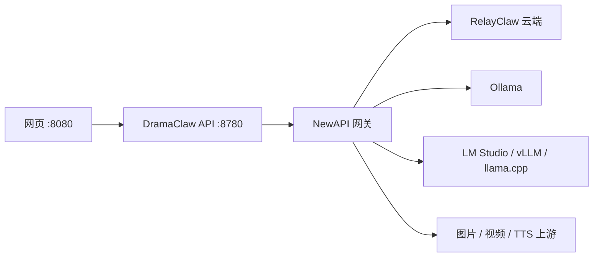

<!-- lang-switch -->
[English](../../en/guides/local-llms.md) · **简体中文**

# 使用本地 LLM 跑 DramaClaw

> 通过 Local NewAPI 接入 Ollama（及其他 OpenAI 兼容本地服务）的端到端指南。

DramaClaw **不会**在应用主机上加载 LLM。API（`:8780`）与网页（`:8080`）只调用 **OpenAI 兼容的 NewAPI 网关**；网关再转发到上游（云端或本机）。网关地址与 token 保存在 **设置 → 模型配置** 写入的本机 `settings.db` 中——CE **不会**从 `MODEL_API_KEY` / `MODEL_PROVIDER` 环境变量读取。



渠道按钮含义、embedding 批量上限、媒体 relay 等见[配置模型供应商](../getting-started/configuring-models.md)。

---

## 1. 先选路径

| 目标 | 路径 | 是否需要映射模型 |
|---|---|---|
| 最快跑通小说 → 成片 | **官方 RelayClaw**（默认 `docker-compose.yml` + DC key） | 不需要 |
| 本机文本 + embedding；图片 / 视频 / TTS 仍走云端 | **混合方案（本地 LLM 推荐）** | 在 Local NewAPI 映射 `DC-*-LLM` 与 `DC-cognee-embedding` |
| 全离线小说 → 成片 | 自托管 NewAPI + **每种模态**都有本地上游 | 难——图 / 视频 / TTS 不是「拉一个 Ollama 聊天模型」就能替代 |

**建议：** 本地优先做混合文本。先让 Hermes + Cognee 在 Ollama 上跑通；媒体继续用 RelayClaw 或其他具备媒体能力的云端上游。

---

## 2. 接入网关

### 官方渠道（完整管线，不跑本地模型）

```bash
cp .env.example .env   # 修改 PROMPT_EXPORT_PASSWORD
docker compose up -d --build
```

打开 `http://localhost:8080` → **设置 → 模型配置 → 官方渠道** → 粘贴 [relayclaw.cdnfg.com](https://relayclaw.cdnfg.com) 的 DC key → **保存并启用**。

### 本地 NewAPI（Ollama / BYO 必需）

```bash
cp .env.example .env   # 修改 PROMPT_EXPORT_PASSWORD
docker compose -f docker-compose.selfhosted.yml up -d --build
```

会启动 `api`、`web` 以及内置 `newapi`（`http://localhost:3000`）。

1. 打开 `http://localhost:8080` → **设置 → 模型配置 → 本地 NewAPI**。
2. 设置首次管理员密码（仅当 NewAPI 尚未初始化时使用）。
3. 点击 **初始化本地 NewAPI**。

向导会创建或复用 `dramaclaw-ce-runtime` token，写入 `settings.db`，并把网关模式切到 `custom`。请自行保存 NewAPI 管理员密码——DramaClaw 不会用它做后续登录。

若 NewAPI 已初始化，密码可留空再点初始化，只会创建/复用 runtime token。

selfhosted 编排已启用 provisioner。细节见[自托管手册](self-hosting.md)。

---

## 3. 启动本机推理后端

### Ollama（一等公民预设）

安装并启动 [Ollama](https://ollama.com)，至少拉取一个聊天模型和一个 embedding 模型：

```bash
ollama pull qwen2.5:14b
ollama pull mxbai-embed-large
ollama pull qwen2.5vl:7b   # 可选：多模态槽位
```

**Docker 网络：** NewAPI 在容器内，Ollama 通常在宿主机。容器里的 `http://localhost:11434` 指向容器自身，不可用。

| 宿主机系统 | Ollama 渠道 Base URL |
|---|---|
| macOS / Windows（Docker Desktop） | `http://host.docker.internal:11434` |
| Linux | `http://172.17.0.1:11434` 或宿主机 IP；或把 Ollama 放进同一 compose 网络 |

Ollama 往往不校验 API key；若 UI 必填，可填占位值如 `ollama`。

### 其他后端（Custom / Xinference）

| 后端 | UI 预设 | 说明 |
|---|---|---|
| **Ollama** | `ollama` | 默认 `http://localhost:11434`——Docker → 宿主机时按上表覆盖 |
| **Xinference** | `xinference` | 填 Xinference 的 OpenAI 兼容地址 |
| **Custom** | `custom` | LM Studio、vLLM、llama.cpp server、LocalAI 等任意 `/v1` 兼容端点 |

---

## 4. 映射逻辑模型

保持 `.env` 中的逻辑名（如 `HERMES_MODEL=DC-hermes-LLM`），在 UI 里映射到真实上游模型 ID。

### 添加 Ollama 渠道

在 **本地 NewAPI** 页：

1. 添加供应商渠道 **Ollama**。
2. 设置 Base URL（见上表）。
3. **保存渠道配置**，再 **更新 NewAPI 渠道**。

### 文本模型（`DC-*-LLM`）

1. 在纯文本区块选择 Ollama 渠道与聊天模型（如 `qwen2.5:14b`）。
2. 对该区块点 **应用到全部**，再按需微调单行。
3. 点击 **保存模型映射**。

Hermes 默认期望较大上下文（`.env.example` 中 `HERMES_MODEL_CONTEXT_LENGTH=131072`）。请改成你本机模型真实支持的最大值。

| 硬件 | 起步建议 |
|---|---|
| 16–24 GB GPU | Qwen2.5 / Qwen3 14B–32B、量化 Llama 3.1/3.3、Mistral Small |
| 8–12 GB GPU | Qwen2.5 7B–14B Q4/Q5、Llama 3.1 8B |
| Apple Silicon | 同系列 + Ollama Metal；优先 7B–32B 量化 |

仓库没有官方「已验证 Ollama 标签」列表——按指令遵循能力与上下文长度选型。

### Embedding（`DC-cognee-embedding`）

必须映射真实 embedding 模型。默认维度 **1024**（`COGNEE_EMBEDDING_DIM`）。

| 示例 Ollama 标签 | 典型维度 | 操作 |
|---|---|---|
| `mxbai-embed-large` | 1024 | 与默认一致 |
| `bge-m3` | 1024 | 与默认一致 |
| `nomic-embed-text` | 768 | 映射并把维度改为 **768** |

建图若出现 HTTP 400/422，降低 embedding 批量（靠近 `10`），并核对维度与映射。见[配置模型供应商](../getting-started/configuring-models.md#embedding-批量大小)。

### 视觉 / 多模态槽位

会发送图片的功能需要 **VLM**（如 `qwen2.5vl:7b`）。纯文本模型会失败。

### 图片 / 视频 / TTS

混合方案下请继续走云端渠道。本地聊天模型填不了 `LingShan-*`、Seedance、`index-tts-2` 等槽位。

更换网关或映射后：新任务会读新配置。若当前进程里 Cognee 已初始化，**重启 DramaClaw** 后再导入小说。

---

## 5. 冒烟检查清单

1. `docker compose -f docker-compose.selfhosted.yml up -d --build`
2. Ollama 已启动；聊天 + embedding 模型已拉取
3. UI 中完成本地 NewAPI 初始化
4. Ollama 渠道 Base URL 从 `newapi` 容器可达
5. `DC-hermes-LLM` / `DC-cognee-LLM`（及其他文本角色）→ 聊天模型
6. `DC-cognee-embedding` → embedding 模型 + 匹配维度
7. 打开 Hermes 发一条短消息
8. 导入一小章小说（Cognee / 知识图谱）
9. 图片 / 视频 / TTS 暂留云端

---

## 不要期望

- 只设 `MODEL_PROVIDER` / `MODEL_API_KEY` **不是** CE 的配置路径。
- README 里的「完全本地」指 **本地网关**，不等于自动具备本地 Seedance / IndexTTS。
- CE 是单机、进程内任务；多租户扩缩容属于企业版。

## 相关文档

- [配置模型供应商](../getting-started/configuring-models.md)
- [自托管手册](self-hosting.md)
- [环境变量参考](../reference/environment-variables.md)
- `.env.example` — 逻辑 `*_MODEL` 默认值
- `docker-compose.selfhosted.yml` — 内置 NewAPI 编排
